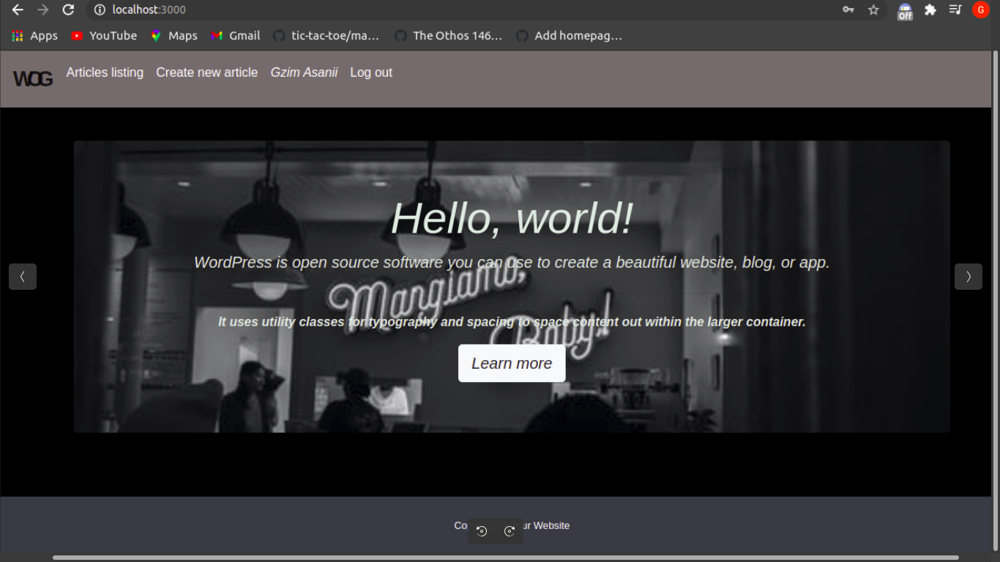

# Secret Group

> This is my next rails project where the project was build with the backend which was neccessary in order to store the information from articles and users, also the authentication was very important part because an authenticated author could see who wrote each article. 

## Features

In this project we developed a simple app with authentication:

- The form uses Bootstrap library for css combined with embedded ruby code
- The back end is set up with a User and Post model that validates presence of username, email and password, using devise gem and validates the presence of Post's description.
- I used devise to perform user's authentication, creating the corresponding actions such as Log in, Log out,Sign up.
- If user check the page without being authenticated, he/she will not be able to see the post's authors and the timestamps from the posts, but it displays when user Log in or Sign up
- Any user who signed up can create own posts.
- Pagination is used for visual appeal.

In this project I developed a simple app with authentication:

- I used Bootstrap library for css and scss
- The back end is set up with a User and Post model that validates presence of username, email and password, using devise gem and validates the presence of Post's description.
- I used devise to perform user's authentication, creating the corresponding actions such as Log in, Log out,Sign up.
-If the user is not authenticated he will not be able to see the authors
-All the users are allowed to create articles

# Built With

- Ruby on Rails
- Ruby
- Rubocop
- VS Code
- Devise gem
- Bootstrap
- Scss
- SQLite3

# Getting Started

  To get a local copy of the repository please run the following commands on your terminal:
- Select a desired location in your computer
- Copy and paste the following code into the Terminal: git clone https://github.com/GzimAsani/AUTHENTICATION-Project.git
- Add devise 'gem' to your gem file
- yarn install --check-files if yarn is not update
- Run bundle install
- Run rails db:migrate.
- Run rails server in your terminal in order to see the layots

## Author

👤 **Gzim Asani**
- Github: [@GzimAsani](https://github.com/GzimAsani)
- Linkedin: [GzimAsani](https://www.linkedin.com/in/gzim-asani-83390a17a/)

## 🤝 Contributing

Contributions, issues and feature requests are welcome!

## Show your support

Give a ⭐️ if you like this project!
